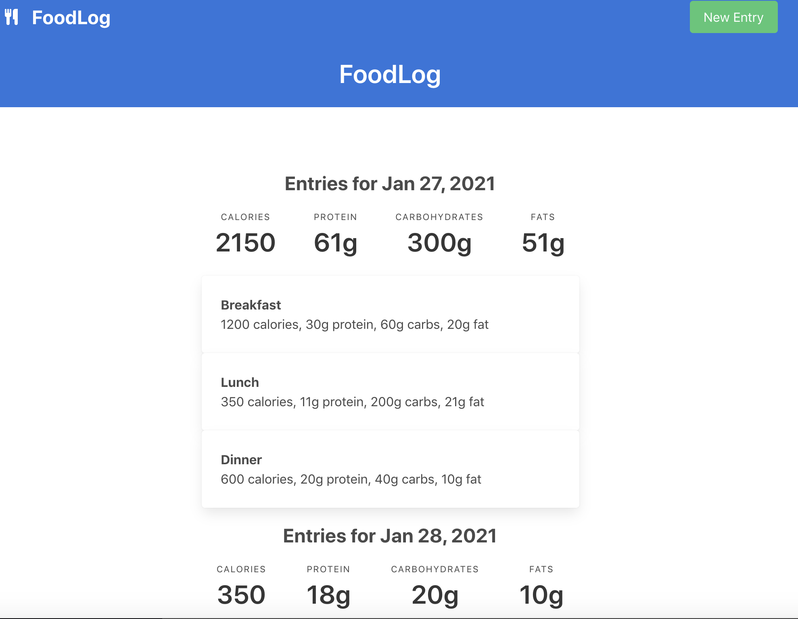
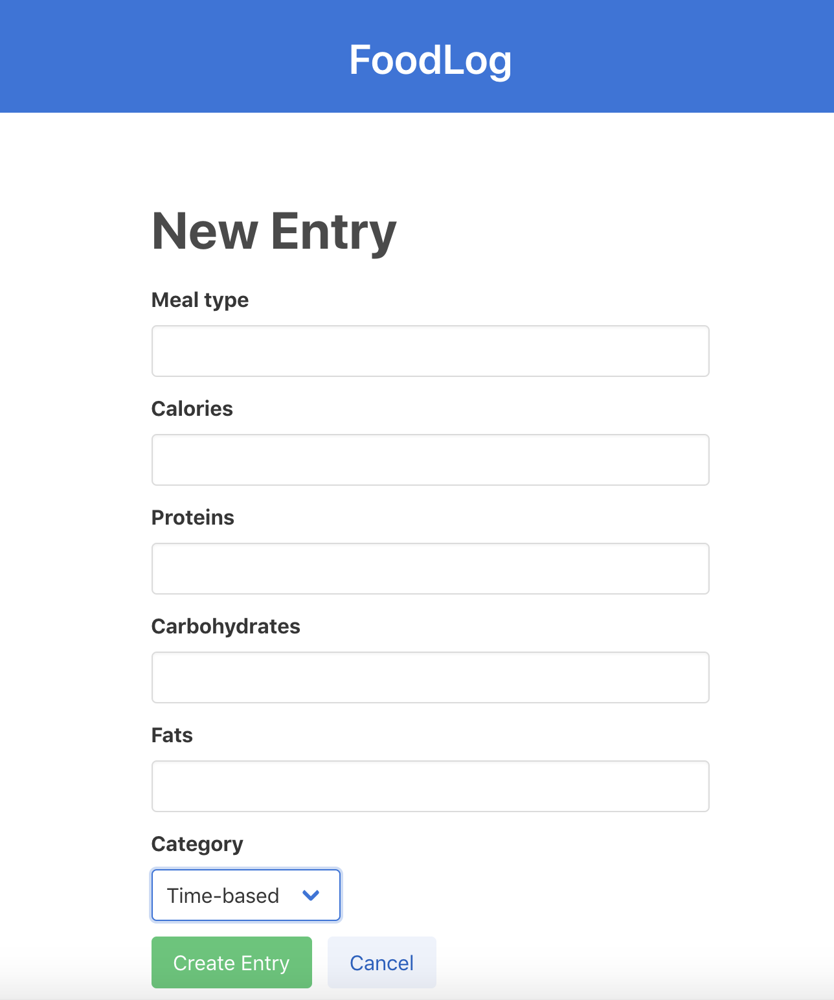
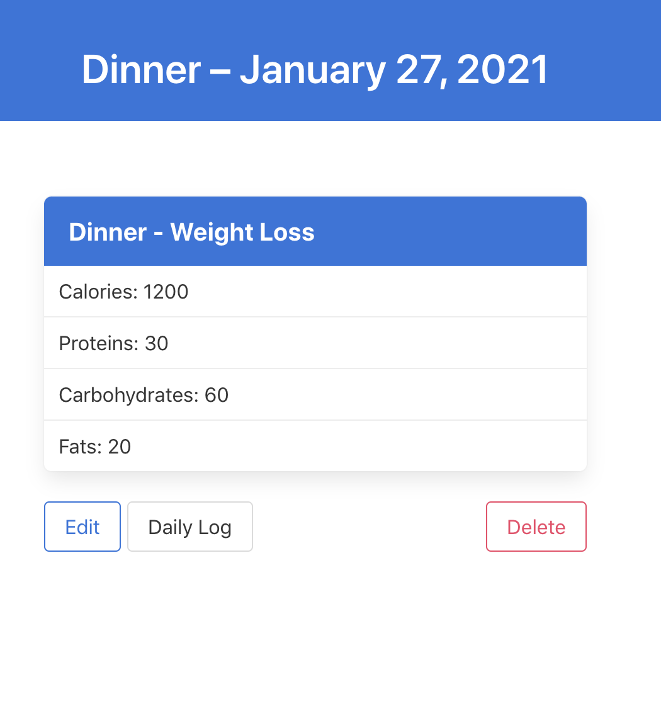

# FOOD LOG

This is an app to track your macros by meal and day. It is based on a [code-along](https://www.youtube.com/watch?v=B3Fbujmgo60) by [Andy Leverenz, web-crunch.com](https://web-crunch.com/). I have made minor changes to the UI and backend.

Rails: 6.1.1

Ruby: 2.6.3p62

UI: Bulma with a Nucleo icon

## I learned some new things in this tutorial:

* Use Bulma UI
* Different way to pass a variable along with the form in render
* Content_for
* How to add an initializer, here we did one for the time format.
* Using Ruby's Strftime
* Pluck - pulls out an entry for each database column that you can then do an operation on, such as sum calories for day
* Have a select drop-down

## To use locally: 

- Clone the repository onto your local machine
- CD into the directory
- Run `bundle install` to install the gems
- Run `rails db:create`	to create the db, migration file
- Run `rails db:migrate` to create the tables
- Run `rails s` to Start the server
- Open your browser and go to `localhost:3000`.
- (ctl - c to stop the server)

Commit defadedf1e1b88ea4b0c was the end of the tutorial, but I had changed my system time to add some earlier meals, instead of doing it in the console. This munged the commit times requiring a rebase, so the end of the tutorial is now mixedin with my changes.

TODO/Issues:
* Add pagination to archive
* Complete testing
* Add Category routes
* Have to choose a category